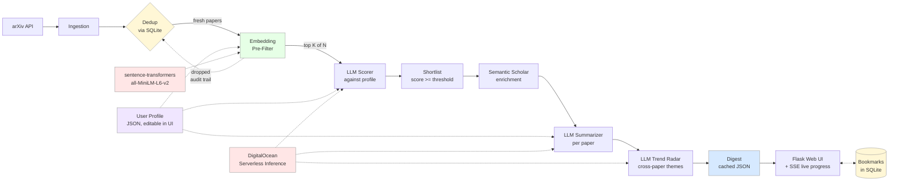

# ArXiv Daily Digest

A personalized academic-research briefing agent. Pulls fresh arXiv submissions, pre-filters them with a local embedding model, scores the survivors against a user-defined research profile using an LLM (hosted on DigitalOcean's Serverless Inference), summarizes the top picks, and surfaces emerging trends across them. Includes a Flask web UI with login, a live progress feed, a bookmarks page, and an in-browser profile editor.

> **CS153 final project.** Built by Alan Zhang. See [AI Usage Disclosure](#ai-usage-disclosure) for collaboration details, [Design Decisions and Limitations](#design-decisions-and-limitations) for engineering trade-offs, and [docs/evaluation.md](docs/evaluation.md) for the evaluation results.

## What works

- **Ingestion** — arXiv API polling by category with date filtering, Semantic Scholar enrichment (citation counts + TLDR) on the shortlist only, and SQLite-backed deduplication so each paper is processed exactly once.
- **Two-stage retrieval** — A local `sentence-transformers/all-MiniLM-L6-v2` embedding pre-filter ranks all new papers by similarity to the profile and keeps the top fraction (default 62%, scales with daily volume). Saves ~38% of LLM scoring calls with ~90% recall on the LLM's eventual top-10.
- **Relevance scoring** — The LLM scores each surviving paper 0–1 against your interest profile. Async pipeline with bounded concurrency (default 40 in flight, batch size 5) so ~150 papers score in a single parallel wave.
- **Summarization** — Top-scored papers get a plain-language summary, key contributions, methodology notes, and connections to previously surfaced papers. Summaries run in parallel too.
- **Trend radar** — The LLM clusters the shortlist into emerging themes when it spots 2+ papers in a shared direction.
- **Web UI** — Single-user Flask app: log in, view the latest digest, edit your research profile in the browser, click *Run pipeline* to regenerate. **Live progress streaming** via Server-Sent Events shows each pipeline stage as it runs (no page refresh needed). **Bookmarks page** lets you save papers and revisit them across runs. **Days-since-last-run hint** pre-fills the lookback window so you don't miss anything when you come back after a few days.
- **Offline evaluation** — A no-label evaluation script running four independent tests: keyword baseline comparison, cross-profile sensitivity, self-consistency on rerun, and a pre-filter recall@K sweep. Outputs to [docs/evaluation.md](docs/evaluation.md).

## Architecture



## Setup

```bash
pip install -r requirements.txt
cp .env.example .env
```

`requirements.txt` includes `sentence-transformers` for the embedding pre-filter. The model (~80 MB) downloads automatically on first run. To skip the pre-filter entirely (e.g. you don't want the dependency), set `EMBEDDING_FILTER_K=0` in `.env`.

Then fill in `.env` (see below), and either edit your profile in the web UI (recommended) or directly:

```bash
cp config/user_profile.example.json config/me.json
$EDITOR config/me.json
```

If you want the app to use that file, set `PROFILE_PATH=config/me.json` in `.env`. Otherwise the webapp auto-bootstraps `config/my_profile.json` from the example on first run and you can edit it through `/profile`.

### Configuring `.env`

| Variable | What it is | How to get it / typical value |
|---|---|---|
| `DO_INFERENCE_API_KEY` | DigitalOcean inference API key | DO Cloud → GenAI Platform → Model Access Keys |
| `DO_INFERENCE_BASE_URL` | Inference endpoint | Defaults to `https://inference.do-ai.run/v1` |
| `DO_INFERENCE_MODEL` | Which model to use | e.g. `openai-gpt-oss-20b`, `llama3.3-70b-instruct` |
| `APP_USERNAME` | Login username | Whatever you want |
| `APP_PASSWORD_HASH` | Login password hash | Run `python scripts/hash_password.py` and paste the output |
| `FLASK_SECRET_KEY` | Session signing key | `python -c "import secrets; print(secrets.token_hex(32))"` |
| `S2_API_KEY` | Semantic Scholar key (optional) | https://www.semanticscholar.org/product/api |
| `SCORING_CONCURRENCY` | LLM calls in flight during scoring | Default 3, cap 60. We run 40. |
| `SCORING_BATCH_SIZE` | Papers per scoring LLM call | Default 10, cap 50. We run 5. |
| `SUMMARIZE_CONCURRENCY` | Parallel per-paper summarization calls | Default 5. We run 10. |
| `EMBEDDING_FILTER_K` | Override pre-filter cutoff (absolute K). 0 disables. | Leave blank to use the ratio formula |
| `EMBEDDING_FILTER_RATIO` | Fraction of papers kept after pre-filter | Default 0.62 |
| `EMBEDDING_FILTER_MIN_K` | Minimum K (floor for small days) | Default 50 |

## Run

### Web UI (recommended)

```bash
python -m webapp.app
```

Then open http://127.0.0.1:5000, log in with the credentials you configured, and click **Run pipeline**. The progress page streams live events from each pipeline stage (ingest → pre-filter → score → enrich → summarize → trend). First run takes ~30–60 seconds for ~150 papers; subsequent same-day runs skip already-seen papers via dedup.

The dashboard shows how many days since your last run and pre-fills the lookback window accordingly. The bookmarks page (`/bookmarks`) lets you save and revisit any shortlisted paper. The profile editor (`/profile`) updates your interests without touching the shipped example file.

### CLI

```bash
python main.py --profile config/me.json --verbose
```

Flags: `--lookback N` (days to look back), `--threshold 0.7` (relevance bar), `--shortlist-max 5`, `--no-enrichment`, `--format json`, `--out digest.md`.

### Evaluation

After you've run the pipeline at least once (so the DB has papers):

```bash
python scripts/evaluate.py --profile config/me.json
```

Writes a markdown report to `docs/evaluation.md`. The script runs four independent tests: LLM vs keyword baseline, cross-profile sensitivity, self-consistency on rerun, and the pre-filter recall@K sweep. See the [results section](docs/evaluation.md) for what each metric means.

### Tests

```bash
python -m pytest tests/ -m "not slow"     # 36 fast unit tests
python -m pytest tests/                    # full suite incl. 1 model-integration test
```

## Layout

```
arxiv_digest/
├── main.py                              # CLI entry point
├── webapp/
│   ├── app.py                           # Flask app: login, dashboard, profile, bookmarks, SSE
│   ├── templates/
│   │   ├── base.html
│   │   ├── login.html
│   │   ├── digest.html                  # Dashboard
│   │   ├── progress.html                # Live SSE feed
│   │   ├── profile.html                 # In-browser profile editor
│   │   └── bookmarks.html               # Saved papers
│   └── static/style.css
├── scripts/
│   ├── hash_password.py                 # Generate APP_PASSWORD_HASH
│   ├── evaluate.py                      # Offline evaluation runner (4 methods)
│   └── benchmark_concurrency.py         # Find safe scoring/summarize concurrency
├── src/
│   ├── llm.py                           # OpenAI-compatible client → DigitalOcean
│   ├── models.py                        # Paper, DigestSummary, TrendCluster dataclasses
│   ├── pipeline.py                      # End-to-end orchestrator with progress callbacks
│   ├── ingestion/
│   │   ├── arxiv_client.py
│   │   ├── semantic_scholar_client.py
│   │   └── storage.py                   # SQLite + dedup + bookmarks
│   ├── scoring/
│   │   ├── embedding_filter.py          # sentence-transformers pre-filter
│   │   ├── relevance.py                 # LLM relevance scorer (async + batched)
│   │   └── keyword_baseline.py          # Substring baseline (evaluation)
│   └── synthesis/
│       ├── summarizer.py                # Parallel per-paper summaries
│       └── trend_radar.py
├── tests/                               # pytest suite (36 unit + 1 integration)
│   ├── test_storage.py
│   ├── test_bookmarks.py
│   ├── test_keyword_baseline.py
│   ├── test_async_scoring.py
│   ├── test_parallel_summarizer.py
│   ├── test_llm_parsing.py
│   └── test_embedding_filter.py         # incl. slow model-integration test
├── config/
│   ├── user_profile.example.json
│   └── eval_profiles/                   # NLP/agents, vision/robotics, theory/crypto
├── docs/
│   └── evaluation.md                    # Generated evaluation results (4 sections)
└── data/                                # Created on first run; gitignored
    ├── papers.db
    └── latest_digest.json
```

## Design Decisions and Limitations

This section captures the engineering judgement calls and what they cost. Many were made in response to problems hit during development.

### Decisions

| Decision | Why | Trade-off |
|---|---|---|
| DigitalOcean serverless inference (OpenAI-compatible) over a local model | Free credit + zero infra cost + access to a wide model catalog. | Locked into hosted models; my account is gated to open-source LLMs only. |
| Two-stage retrieval (embedding pre-filter → LLM scorer) | The LLM is the slowest stage and most papers are obviously off-topic. Filtering down to top K with cheap local embeddings cuts LLM calls ~38% with ~90% recall on the LLM's true top-10. | Embedder is general-purpose and underweights subtle topical matches; ~10% of LLM picks can get dropped (documented in [evaluation.md §4](docs/evaluation.md)). |
| Fractional pre-filter K (default 62% of N, floored at 50) | Recall depends on K/N, not absolute K. Scaling with N keeps recall stable as daily volume changes. | A fixed K would have silently degraded as the firehose grows. |
| Async + concurrent scoring (asyncio + semaphore) | ~10× wall-clock speedup vs. sequential. Concurrency 40 + batch size 5 lets ~150 papers score in one parallel wave. | Higher concurrency risks DO rate-limiting; cap is 60. Tunable via `SCORING_CONCURRENCY` env. |
| Parallel summarization (concurrency=10) | Shortlist is ~10 papers; running summaries serially would dominate wall-clock time. | A single bad JSON response defaults that summary; tracked per-call. |
| Scoring at temperature=0 | Self-consistency was poor at temp=0.2 (Spearman 0.04). Dropping to temp=0 raised it to 0.54 and halved score wobble. | Not bit-deterministic even at 0 due to GPU floating-point non-determinism; rank correlation caps near 0.5 for this model. |
| Batched scoring (default 10, configured to 5) | Lower per-paper round-trip overhead and the profile prompt is shared across the batch. Smaller batches let the same concurrency cover more parallel waves. | Whole batch fails together if the model returns malformed JSON; failed batches default to score=0 with a logged rationale. |
| Structured LLM outputs: JSON-mode + schema hint + retry-on-parse-failure | Three-layer defense against malformed output: API-level JSON forcing, in-prompt schema example, and one retry on parse error. | Adds latency on retries; one persistent failure still loses a batch. |
| SQLite for storage | Zero config, single file, perfect for a single-user app. Stores papers, scores, summaries, prefilter-drop audit trail, and bookmarks. | Won't scale to multi-user; no concurrent writers. Acceptable for the milestone scope. |
| Server-Sent Events for live progress | Pipeline is long-running (~30–60s). SSE lets the browser show stage-by-stage progress without polling, and clients reconnecting mid-run replay history from a queue. | One persistent connection per browser tab; not problematic at single-user scale. |
| Pipeline runs in a background thread, not the request | The `/refresh` POST returns immediately and the user is redirected to `/progress`, which subscribes to the SSE stream. No 1–3 minute hang. | Single shared `RunState` — only one pipeline run at a time per server. |
| Filter arXiv by `result.updated` (not `published`) | Matches arXiv's `submittedDate` sort criterion. Filtering by `published` caused 0-paper fetches because v2-of-old-paper appears at the top of the list. | Includes paper revisions, not just new submissions. Most users want both. |
| Enrich with Semantic Scholar **after** shortlisting | Semantic Scholar rate-limits unauthenticated requests aggressively (~1/sec). Enriching 200+ papers pre-shortlist took 20+ minutes; enriching the top 10 takes 10–30 seconds. | Citation count for fresh papers is almost always 0, so this stage adds little daily-digest value; kept for the eventual sleeper-paper detection roadmap item. |
| Bookmarks live in SQLite, separate table | Survive across runs and DB updates. Joined back to `papers` on lookup so the bookmarks page shows full paper detail. | Bookmarks are bound to arxiv_id; if the paper row were ever purged, the join silently drops it. |
| Days-since-last-run hint + auto pre-fill | The lookback window is the one knob users get wrong most often after a few days away. Surfacing it removes a mental step. | Reads from `latest_digest.json` so it only reflects successful runs that produced content. |

### Limitations

- **No real users for evaluation.** All four evaluation methods are internal. Cross-profile sensitivity (Jaccard 0.00–0.05) is strong evidence the personalization works, but it doesn't prove the LLM's specific picks match what a real researcher would want to read. A user study would settle this; bookmarks could feed it.
- **Self-consistency caps near 0.5 Spearman.** Even with scoring temperature=0, the LLM isn't bit-deterministic due to GPU floating-point non-determinism. Top-10 set still rotates by ~4 papers between two reruns (Jaccard 0.43) because many candidates cluster in a narrow score band at the top. Median-of-3 scoring would close this further at 3× LLM cost; not implemented.
- **Pre-filter loses ~10% of LLM picks at the default K/N.** The general-purpose embedder underweights subtle topical matches that the LLM catches. A domain-tuned embedder (e.g. SPECTER2) or a hybrid BM25+embedding retriever would close the gap. Documented but not built.
- **Recall@K vs N is theoretically argued, not empirically swept.** Database is single-day. The fractional K formula assumes K/N is the right invariant; verifying this across days with different volumes is future work.
- **Daily batching.** arXiv announces papers once per day (mostly weekdays). An off-hour run can yield zero new papers; the UI flashes a notice and preserves the previous digest.
- **Single user.** No multi-tenant support; one profile per deployment. The `rating_history` slot exists in the profile schema, but no feedback writes to it yet.
- **Dashboard shows only the latest run.** Yesterday's good picks vanish from the digest view tomorrow. The DB still holds them; bookmarks are the explicit workaround for important papers. A "rolling N-day picks" view querying the DB is a future addition.
- **Profile edits don't re-score history.** Change your interests and previously-scored papers keep their old scores. A "re-score all" button is straightforward to add (~30 min).

## AI Usage Disclosure

This project was built with substantial assistance from **Claude (Anthropic)** acting as a coding collaborator. Claude was used for:

- Generating much of the boilerplate (Flask scaffolding, SQLite schema, dataclass definitions, template HTML/CSS).
- Migrating the LLM integration from Anthropic's SDK to an OpenAI-compatible client targeting DigitalOcean.
- Debugging real issues during development: the arXiv `published` vs `updated` sort criterion bug, Semantic Scholar rate-limit handling, DigitalOcean model availability (404/403 errors), JSON parsing fragility across hosted models, and a silent concurrency cap bug that was clamping `SCORING_CONCURRENCY=25` to 10.
- Drafting documentation, including parts of this README and the evaluation report.

**Claude is not the runtime model.** Paper scoring, summarization, and trend clustering at runtime are performed by an open-source LLM hosted on DigitalOcean Serverless Inference (typically `openai-gpt-oss-20b`), selected via the `DO_INFERENCE_MODEL` environment variable. The Anthropic API is not called at runtime; Claude's role was strictly as a development-time pair programmer.

**Concrete example of human oversight overriding AI suggestion**: when adding the embedding pre-filter, Claude proposed K=75 as a "near-loss-free" default ("~95% recall expected"). I measured it on real data — actual recall was only 60%. I then ran a 7-point K sweep, observed a plateau pattern in the curve, and chose K/N=0.62 from the data. Both the prediction and the correction are documented in [docs/evaluation.md §4](docs/evaluation.md). All architecture decisions, scope choices, evaluation design, and validation of LLM output were made by Alan Zhang. The LLM was treated as a fast pair-programmer for execution, not as an author of design choices.

## Acknowledgments

- **arXiv** for the open API — https://arxiv.org/help/api
- **Semantic Scholar** for citation enrichment — https://api.semanticscholar.org
- **DigitalOcean GenAI Platform** for hosted LLM inference
- **Hugging Face / sentence-transformers** for the `all-MiniLM-L6-v2` embedding model
- **Python libraries**: `arxiv`, `openai`, `flask`, `werkzeug`, `python-dotenv`, `requests`, `pytest`, `sentence-transformers`
- **Course staff** for the CS153 project framework

## Roadmap (next milestones)

- **Re-score on profile edit** — wipe `relevance_score` on DB papers and re-trigger scoring without a fresh arXiv fetch.
- **Tier-2 summary persistence** — store the full structured summary (key contributions, methodology notes, connections) in the DB so the bookmarks page shows complete cards, not just the plain-language line.
- **Rolling N-day picks view** — dashboard route that queries the DB for `score >= threshold AND updated >= now - N days` instead of reading the latest snapshot.
- **Hybrid retrieval** — union top-K from embeddings with top-K from BM25 to recover the subtle topical matches the embedder underweights. Documented as a mitigation in the evaluation report.
- **Median-of-3 scoring** — run scoring three times and take the median per paper. Pushes self-consistency past the temp=0 ceiling at 3× cost.
- **Delivery** — email (SendGrid) and Slack webhook rendering.
- **Feedback loop** — thumbs-up/down ratings (or bookmark events) written back into `profile.rating_history`. The profile schema already has the slot and the scorer reads it; nothing writes to it yet.
- **Scheduling** — daily cron / cloud function run, replacing the manual *Run pipeline* click.
- **Sleeper-paper detection** — trend citation counts over time using Semantic Scholar to flag papers gaining unexpected traction. (This is why the S2 enrichment stage exists despite citations being 0 for fresh papers today.)
